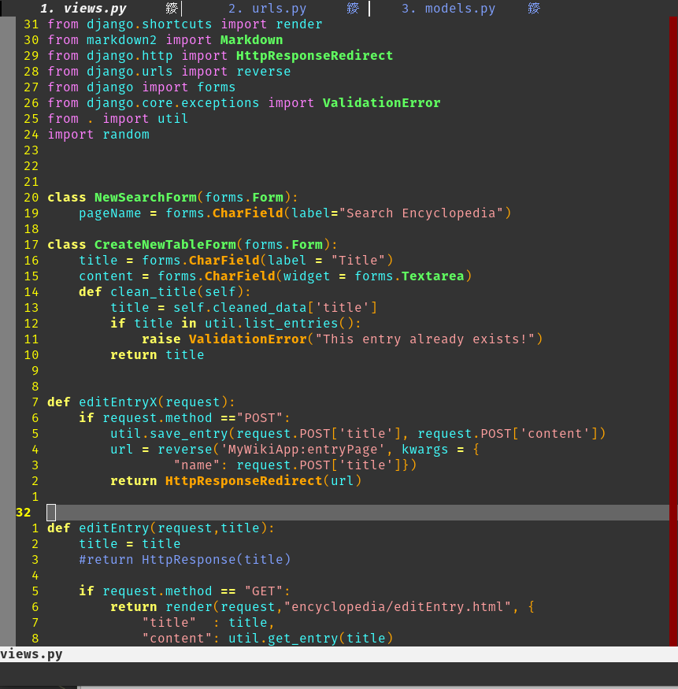

# my_vim_config
this is actually my neo vim config! Written purely in Lua. A High-Performance, Modular Neovim Configuration Engineered for Peak Developer Efficiency.
Why Neo Vim instead of vim? Because you can write all of your config files using Lua , a super simple and lightweight language that you can learn quickly. 

Welcome to my pure Lua Neovim configuration. Custom-designed for modern development workflows, this configuration integrates a Language Server Protocol (LSP) that supports JavaScript, Python, HTML, and CSS, creating a smooth coding experience across multiple languages.

I've implemented numerous unique remaps and integrated various other plugins, all configured for optimal usability. Each part of this configuration contributes to a more efficient and enjoyable coding experience, making development faster, easier, and more powerful." The most useful I think are relative line numbers for jumping around like a wizzard, an awesome color scheme, allowing jj to take be from insert mode to normal mode instead of esc. And showing the file tabs on the top was a big help for me.  Get used to loading in your own plugins! It is fun! 

Check out the awesome look:

Modularity is a prime feature of this configuration with a neatly organized folder structure that separates various elements like auto-completion, remaps, and plugin configurations. This separation allows for easy customization, extension, and maintenance.

Key components include Packer, a lightweight and fast plugin manager, and Telescope, an ultra-extensible fuzzy finder, enhancing file navigation and access. Tree-sitter provides robust syntax highlighting and better parsing, while UndoTree offers a comprehensive visualized undo history.

Shout out to the primeagen, one of my favorite youtubers. He encouraged me to switch from VScode to vim. I followed his youtube video on how to create a pure lua neo vim config using packer. Most of the file structure shown here is taken directly from him.  I followed the Primeagens workflow which is to first to list all the config for downloading whatever plugin you want to include, running a :PackerSync to make sure packer downloads it properly, and then head into my after/plugin folder to add a seperate config file for the individual plugin.    It really is simple when you get used to it.  
